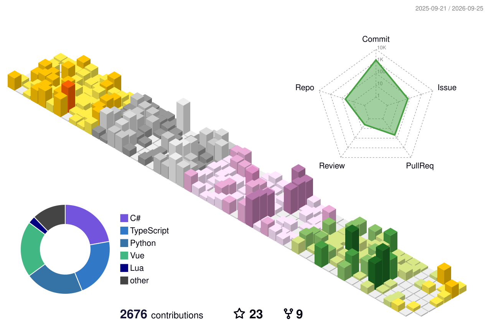

<!-- ## Hi there 👋 -->
<!--  -->
<!-- </img> -->
<!-- - 💬[My Blog (Lack in update)](https://blog.whispery.top) -->

## 👋 Hi there

**I am a cross-disciplinary learner who enjoys creating new concepts and exploring, understanding, and experiencing knowledge across different domains.**

Now focusing on:
- 🎮 Game Developing
- 🤖 Deep Learning && AI Application

Also see:
- 💬[我的博客 / My Blog](https://www.aaafishcat.top)
- 🔥[我的图书馆 / My Digital Garden](https://lib.aaafishcat.top)

## 🍰 Stack Taste
Sort by preference in ascending order.

  

    <strong>Programming Languages</strong> 
    &nbsp;&nbsp;&nbsp;&nbsp;
        
        
        
        
        
        
        
        
        
        
        
  

  

    <strong>Web Technologies</strong> 
    &nbsp;&nbsp;&nbsp;&nbsp;
        
        
        
        
        
        
        
        
        
  

  

    <strong>Game Development</strong> 
    &nbsp;&nbsp;&nbsp;&nbsp;
        
        
        
        
        
  

  

    <strong>Application Frameworks</strong> 
    &nbsp;&nbsp;&nbsp;&nbsp;
        
        
        
        
  

  

    <strong>Databases</strong> 
    &nbsp;&nbsp;&nbsp;&nbsp;
        
        
        
        
        
  

  

    <strong>Editors</strong> 
    &nbsp;&nbsp;&nbsp;&nbsp;
        
        
        
        
        
  

  

    <strong>Development &amp; Deployment</strong> 
    &nbsp;&nbsp;&nbsp;&nbsp;
        
        
        
        
        
  

  

    <strong>Writing &amp; Knowledge</strong> 
    &nbsp;&nbsp;&nbsp;&nbsp;
        
        
        
        
  

<!-- 

Click here for detailed info!

 -->

## 📈 Activity Stats

<!--

-->

  <b>Diving into code with hours:</b>
   
   
  
   
  
    Tracking with <b>WakaTime</b> since Dec 6, 2025
  
   

Click here for more stats!

<!-- 

  
  

 -->

  
  

<!--  -->

<!--
**FishCat233/FishCat233** is a ✨ _special_ ✨ repository because its `README.md` (this file) appears on your GitHub profile.

Here are some ideas to get you started:

- 🔭 I’m currently working on ...
- 🌱 I’m currently learning ...
- 👯 I’m looking to collaborate on ...
- 🤔 I’m looking for help with ...
- 💬 Ask me about ...
- 📫 How to reach me: ...
- 😄 Pronouns: ...
- ⚡ Fun fact: ...
-->
